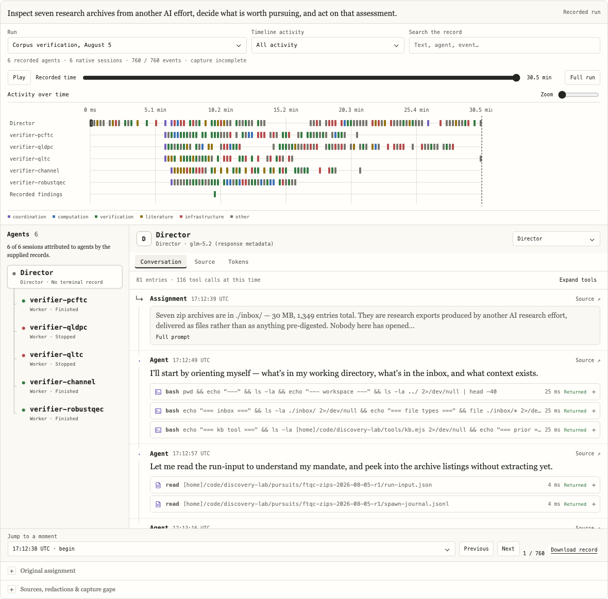

# Agent Record

A React component for reading what an agent team did: conversations, tool inputs and outputs, topology, timelines, and recorded token usage.

[Live example](https://drewstone.github.io/agent-record/) · [Research using the viewer](https://drewstone.github.io/research/bcww/#agent-record)



## Install

```sh
pnpm add https://github.com/drewstone/agent-record/releases/download/v0.5.1/drewstone-agent-record-0.5.1.tgz react react-dom
```

The release is an ESM package with TypeScript declarations and CSS.
It is distributed through GitHub Releases; this version is not published to the npm registry.
React 18.3 and 19 are supported peer versions; release verification uses React 19.

```tsx
import { AgentRecord, parseRecord } from '@drewstone/agent-record'
import '@drewstone/agent-record/styles.css'

const record = parseRecord(await response.json())

export function RunPage() {
  return <AgentRecord records={[record]} />
}
```

Your application loads the data and decides which content may be displayed.
The component makes no network requests, stores no data, starts no agents, and does not change your URL.
It can render on the server; hydration enables the interactive controls.
Use a client component when embedding it in a React Server Components application.

## Research reports

Use `ResearchReport` to read authored claims, limitations, checks, and source references alongside each play’s recorded events.
A compact play navigation opens Results, Activity, or Sources in one reading area. Search retained activity across agents, inspect readable tool inputs/results, and open exact source citations. Missing conversation capture remains explicit.
The offline `agent-record-report REPORT.json OUTPUT.html` command creates a self-contained interactive report and LaTeX document.
Reports remain separate from immutable execution records. Source search can optionally use one commissioned same-origin endpoint; offline reports make no network requests.
See [the report contract and exports](docs/research-reports.md).

## Input

`agent-record.v1` contains a run ID, title, nodes, and timestamped events.
`parseRecord(unknown)` validates the record and preserves additional metadata.
It rejects duplicate node/event IDs, invalid timestamps, parent cycles, invalid session joins, and duplicate published call IDs within an event.

Nodes distinguish agents, native sessions, and findings.
An importer can join a session to an agent with `agentId`; the viewer never infers that relationship from names or timing.
Roles and assignments are independent fields.
A parent missing from a partial capture remains unresolved.

Events carry messages, tool inputs/results, usage, or lifecycle information.
Source paths, hashes, original IDs, timestamps, publication notes, and unknown metadata remain in the downloadable record.
Missing measurements remain unknown.
An explicit zero remains zero.

See [the record format](docs/record-format.md) for the complete input rules and an example.

### Existing blog records

```ts
import { fromResearchPublication } from '@drewstone/agent-record/adapters/research-publication'

const record = fromResearchPublication(reviewedPublication)
```

This adapter accepts the blog's `research-publication.events.v1` files.
It preserves their events and source references while translating node identities into the reusable format.
It does not review, redact, or sanitize private logs.

### Agent-runtime run directories

`node tools/ingest.mjs <dir> --out record.json [--run-id <id>] [--manifest <snapshot.json>] [--native <dir>]` converts an agent-runtime run directory, including Claude Code, OpenCode, pi, Codex and Kimi conversations where the run retained them, or a bundle of native sessions (`bundle.json`). Event IDs are anchored to the stored bytes they came from (`anchor.v1`, see [the record format](docs/record-format.md#event-ids-idscheme-anchorv1)).
Each node's capture channel and every missing transcript are recorded in the output.
See [the record format](docs/record-format.md#agent-runtime-run-directories).

## Run workspace

`dist/workspace-viewer.js` renders a play page and a run page from a same-origin run workspace API, for example the Tangle Discovery wall:

```html
<link rel="stylesheet" href="/assets/agent-record/styles.css">
<div id="agent-workspace" data-api="/api/discovery" data-mode="run" data-id="research-math-20261004system3"></div>
<script src="/assets/agent-record/workspace-viewer.js" defer></script>
```

The play page shows the play's input and files, its runs as a lineage graph and table, paid and list-price spend, and a runs by headline-dimension assessment matrix.
The run page shows the agent topology at the replay time, each agent's conversation with tool calls paired to their results, the activity timeline, token usage, spend per agent and sandbox, the trace assessment scorecard with links to the cited events, the run input and capture coverage.
It reads `plays/<id>`, `runs/<id>`, `runs/<id>/record`, `runs/<id>/assessments`, `runs/<id>/source/<sha256>` and `dimensions` under `data-api`; the shapes are the schemas in `@drewstone/agent-record/workspace` and `/assessment`.
Page state lives in the URL (`?tab=&run=` on a play, `?node=&event=&tab=&t=&dim=` on a run), and a running run polls every 10 seconds.
Theme tokens come from the host: `--ar-background`, `--ar-surface`, `--ar-raised`, `--ar-line`, `--ar-foreground`, `--ar-muted`, `--ar-faint`, `--ar-accent`, `--ar-frame`, `--ar-ok`, `--ar-warn`, `--ar-crit`, `--ar-font` and `--ar-mono`.

The conversation list renders only the rows near its viewport, so records with tens of thousands of events stay responsive.

## Interaction and embedding

The viewer includes a recursive agent tree, scrollable activity timeline, conversation, source inspector, and usage plots.
Tool inputs and results are paired by the original node ID and call ID, within one run.
Repeated call identities are marked ambiguous; a missing result is not treated as success.
A result returned before its call's recorded timestamp stays visible, with its timing discrepancy labeled.

Replay supports adjustable speed, recorded time, event steps, and reduced motion.
The time cursor hides future content in conversation, source details, and tooltips.
Usage plots distinguish input, output, cache read, and cache write counters.
Tool return time is the observed call/result interval, including queue and tool time; it is not model latency.
Recorded order follows the supplied event array.

```tsx
import { useState } from 'react'
import { AgentRecord, type RecordSelection, type RunRecord } from '@drewstone/agent-record'

function ControlledViewer({ records }: { records: readonly RunRecord[] }) {
  const [selection, setSelection] = useState<RecordSelection>({
    runId: records[0].runId,
    eventId: 'an-original-event-id',
    view: 'source',
  })
  return <AgentRecord records={records} selection={selection}
    onSelectionChange={setSelection} theme="dark" />
}
```

| Prop | Meaning |
| --- | --- |
| `records` | Readonly array of validated `RunRecord` objects; run IDs must be unique. |
| `selection` | Controlled run, node, event, time cursor, and tab. |
| `defaultSelection` | Initial selection when the component owns its state. |
| `onSelectionChange` | User selection callback; use it to implement URLs or persistence. |
| `theme` | `auto`, `light`, or `dark`; defaults to the system theme. |
| `className` | Additional class for host styles. |

`RecordSelection` has `runId`, optional `nodeId`, `eventId`, `at`, and `view` (`chat`, `source`, or `usage`).
Omit `at` to show the complete record.
Pass new immutable record objects when evidence changes.
Several viewers can share a page without sharing state or DOM IDs.
The example includes a second-instance toggle.

Import CSS once.
All selectors are scoped to `.agent-record`; it does not restyle the surrounding page.
Override `--ar-background`, `--ar-foreground`, `--ar-font`, and `--ar-mono`, or the semantic tokens in [styles.css](src/styles.css).

## Run the example

```sh
pnpm install --frozen-lockfile
pnpm build
pnpm dev
```

The example uses reviewed records from the research site.
Redactions and excerpts are labeled; the original discovery capture is incomplete.
Open a record file to inspect your own data entirely in the browser.

## Release checks

```sh
pnpm install --frozen-lockfile
pnpm build
pnpm typecheck
pnpm test
pnpm build:example
pnpm pack
```

[Consumer evidence](docs/evidence/README.md) covers the built package, browser interactions, source preservation, server rendering, and the blog integration.
The conversation renders only the rows near its viewport.

Extracted from [Drew Stone's research site](https://github.com/drewstone/drewstone.github.io) at `95e0aaf`.
Code is MIT licensed.
Example records retain their source references and publication notes; upstream papers and excerpts retain their original rights.
